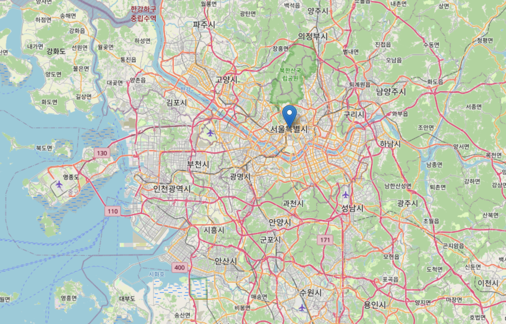

# IP Geolocator and Mapper

A Python script that retrieves your public IP address, geolocates it to obtain location data, and generates an interactive map visualization of the location.

## Features

- Fetches your public IP address.
- Retrieves geolocation data (e.g., country, city, latitude, longitude) for the IP.
- Generates an HTML map file displaying the location.
- Outputs data in a readable JSON format.

## Output Example

```bash
Public IP address is 192.0.2.1
Geolocation data:
 {
    "ip": "193.56.113.69",
    "city": "Helsinki",
    "region": "Uusimaa",
    "country": "FI",
    "loc": "60.1695,24.9354",
    "org": "AS209854 Cyberzone S.A.",
    "postal": "00100",
    "timezone": "Europe/Helsinki"
}

➡️ Open it in a browser to check it out.
```

  

## Prerequisites

- Python 3.x
- Required Python packages (install via pip):
  - `json` (built-in)
  - `socket` (built_in)
  - `requests`
  - `folium`
  
## Installation

1. Clone or download this repository.
2. Ensure the custom modules (`public_ip.py`, `geolocate.py`, `create_map.py`) are in the same directory or installed in your Python path.
3. Install any external dependencies if the custom modules require them (e.g., requests for API calls, folium for map generation).

## Usage

Run the script directly:

```bash
python main.py

```

## Modules Overview

- `public_ip.py`: Contains `get_public_ip()` function to retrieve the public IP address.
- `geolocate.py`: Contains `geolocate_ip()` function that expects the retrieved IP address as parameter and fetches geolocation data from the API.
- `create_map.py`: Contains `get_map()` functions that in return expects the geolocation data retrieved as a funtion parameter, and generates an HTML map file called `ip_map.html` based on it.
  